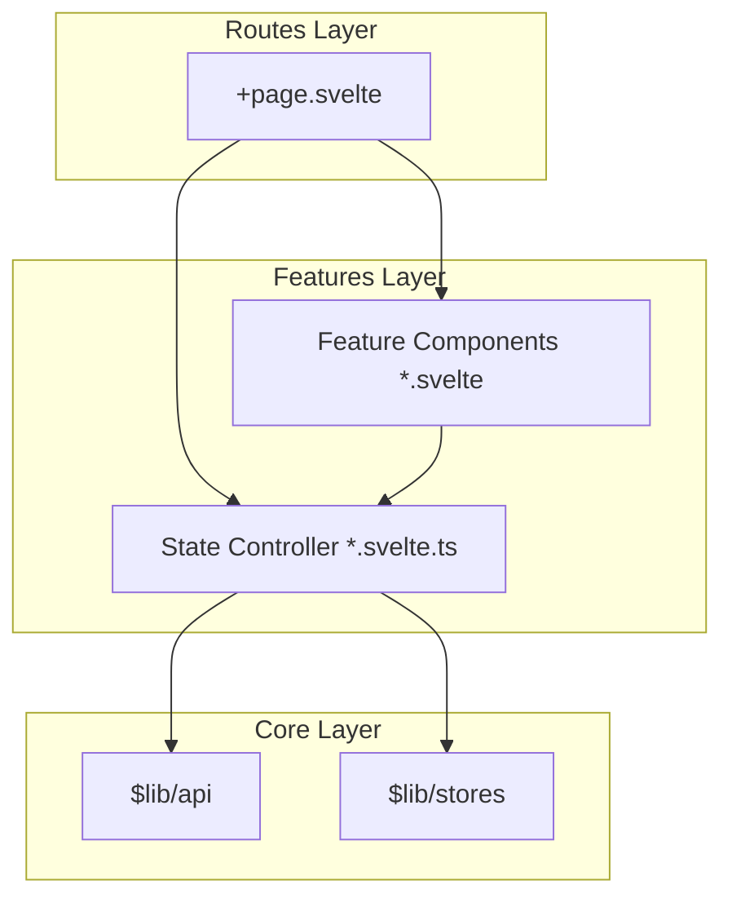

# Labuh Frontend

Frontend dashboard for Labuh - a lightweight PaaS platform. Built with **Svelte 5** using **Runes** and a **Pragmatic Feature-Sliced Architecture** to ensure reactivity, modularity, and high performance on resource-constrained devices.

## 🏗️ Architecture Overview

Labuh Frontend follows a "Feature-Sliced" pattern where logic and UI are co-located within feature directories. This avoids the complexity of large monolithic pages and enables better separation of concerns.

### 🧩 Components & Flow



### 📂 Directory Structure

- `src/lib/features/`: **The Heart of the App**. Each subdirectory (e.g., `stacks`, `containers`) contains:
  - `*-controller.svelte.ts`: A Svelte 5 class managing state and logic via Runes.
  - `components/`: UI components specific to this feature.
- `src/lib/api/`: **Data Layer**. Centralized backend communication client.
- `src/lib/stores/`: **Global State**. Shared stores for Auth, Active Team, and Theme.
- `src/lib/components/`: **Shared UI**. Common components like UI primitives (from shadcn-svelte).
- `src/routes/`: **Views**. Page definitions that instantiate controllers and compose feature components.

### ⚡ Key Concepts: Svelte 5 Runes

We leverage Svelte 5 Runes for robust reactivity:

- `$state`: For declaring reactive state inside controllers.
- `$derived`: For state that depends on other reactive values.
- `$effect`: For handling side-effects like data fetching or DOM updates.
- **Controller Pattern**: Logic is extracted from `.svelte` files into `.svelte.ts` classes, making them testable and keeping views clean.

## 🛠️ Tech Stack

- **Framework**: [SvelteKit 2.x](https://kit.svelte.dev/)
- **State Management**: [Svelte 5 Runes](https://svelte.dev/blog/runes)
- **Styling**: [Tailwind CSS](https://tailwindcss.com/)
- **UI Components**: [shadcn-svelte](https://shadcn-svelte.com/)
- **Icons**: [Lucide Svelte](https://lucide.dev/)
- **Notifications**: [Svelte Sonner](https://svelte-sonner.vercel.app/)

## 🚀 Getting Started

### Prerequisites

- [Node.js](https://nodejs.org/) (v18 or later)
- [npm](https://www.npmjs.com/)

### Configuration

Create a `.env` file in the `frontend` root:

```env
PUBLIC_API_URL=http://localhost:3000
```

### Running Locally

```bash
# Install dependencies
npm install

# Start development server
npm run dev
```

### Build for Production

The frontend uses `@sveltejs/adapter-static` for extreme efficiency, producing a purely static build that the Rust backend can serve directly.

```bash
npm run build
```

The output will be in the `build/` directory.

## 🧪 Quality & Verification

```bash
# Type checking and Svelte validation
npm run check

# Formatting
npm run format

# Production build test
npm run build
```

---

⚓ _Labuh - Docking your containers with stability._
